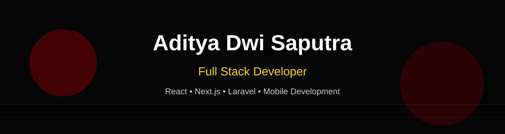

<div align="center">



<br><br>


<br><br>

<a href="https://github.com/aditsiapadah">

</a>


</div>

---

# 👋 Hello World!

```javascript
const aditya = {
    name: "Aditya Dwi Saputra",

    username: "aditsiapadah",

    location: "Indonesia 🇮🇩",

    role: "Full Stack Developer",

    code: [
        "JavaScript",
        "TypeScript",
        "PHP",
    ],

    frontend: [
        "Next.js",
        "Tailwind CSS",
        "Bootstrap"
    ],

    backend: [
        "Laravel",
        "Node.js",
    ],

    database: [
        "MySQL",
        "MariaDB",
    ],

    tools: [
        "Git",
        "GitHub",
        "Figma",
        "VS Code",
    ],

    currentlyLearning: [
        "React Native",
        "Docker",
        "Cloud"
    ]
}
```

---

# 🚀 About Me

- 💻 Full Stack Web Developer
- 🌱 Currently learning **React Native**, **Docker**, and **Cloud Computing**
- 🚀 Passionate about building modern, scalable, and user-friendly applications
- 🎯 Interested in Web Development, Mobile Development, UI/UX, and Open Source
- ☕ Coffee + Music + Code = Perfect Day

---

# 🛠️ Tech Stack

<div align="center">

### Frontend


<br><br>

### Backend


<br><br>

### Database


<br><br>

### Tools


</div>

---

<div align="center">

### 💬 Favorite Quote

> *"First, solve the problem. Then, write the code."*  
> — John Johnson

</div>

---

# 🔥 GitHub Streak

<div align="center">


</div>


---

# 📈 Contribution Activity

<div align="center">


</div>


---

---

# 🐍 Contribution Snake

<div align="center">


</div>


---
---

# 📫 Contact

<div align="center">

If you want to collaborate or just say hello, feel free to reach out.

<br>

<a href="mailto:your-email@gmail.com">

</a>

<a href="https://github.com/aditsiapadah">

</a>

</div>
